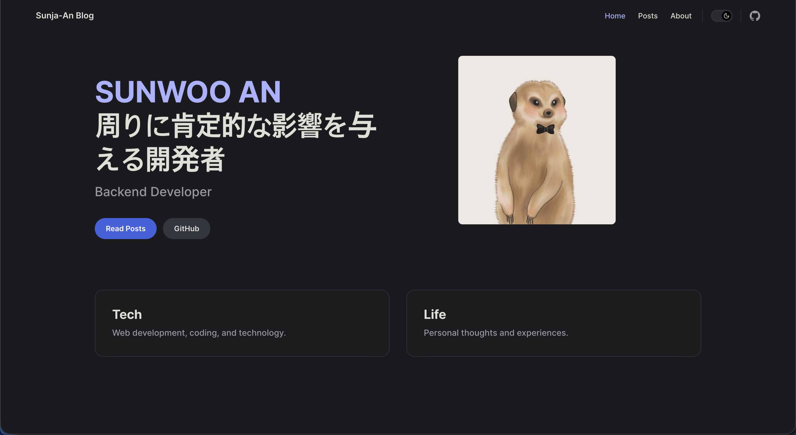

# Sunja-An Blog

## ようこそ！私のブログへ！

こんにちは、**アン・ソヌ** (Sunja An) と申します。

私は「**周りに肯定的な影響を与える開発者**」を目指しているバックエンドエンジニアです。
Republic of Korea 出身で、現在は **Java**, **Spring Boot** を中心に技術を磨いています。

このブログでは、私が学習した新しい技術や開発中に直面した課題、そしてそれをどのように解決したかというプロセスを記録し、共有しています。  
私の経験や学びが、同じような悩みを持つ開発者の方々にとって少しでも役立つことを願っています。

### 主な技術スタック
- **Languages**: Java, Go
- **Frameworks**: Spring Boot, Gin
- **Infra**: Docker, AWS, GCP
- **Database**: MySQL, Redis

---
*For more details, please visit my [About Page](/about).*